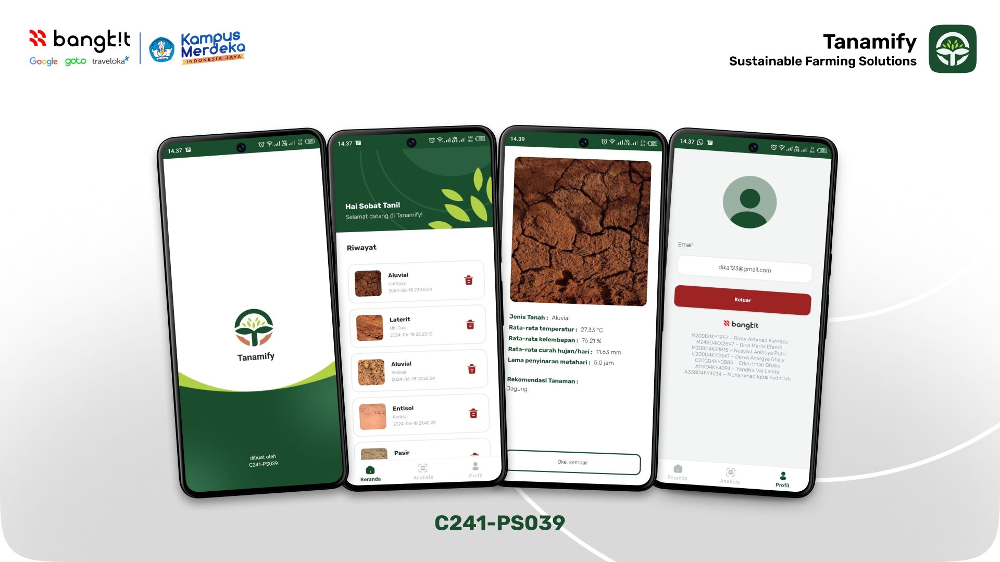

# MD-Tanamify
Tanamify: Sustainable Farming Solutions 🌱

    

## About The Project

<div align="center">
      
</div>
<br />
Tanamify is a mobile app using machine learning to optimize crop selection based on local soil and climate data.
We understand the significant challenges farmers and communities face in assessing land suitability for farming, primarily due to limited knowledge of soil characteristics. This often leads to reliance on traditional planting methods, resulting in mismatches between soil types and the crops grown, ultimately lowering crop yields. 🌾 Additionally, local climate conditions play a crucial role in impacting agricultural productivity.
<br /><br />
At Tanamify, we are committed to addressing these challenges with a holistic approach: <br />
🌟 Enhancing Crop Yields: By providing accurate data and recommendations, we help farmers maximize their harvests. <br />
🌟 Minimizing Risks from Unsuitable Crops: Our solutions prevent crop failures by ensuring the right crops are planted in the right soil. <br />
🌟 Aiding in Land Assessment: We offer precise land assessments to help farmers understand their land better. <br />
🌟 Offering Tailored Crop Recommendations: Our recommendations consider both local climates and soil types, ensuring optimal crop growth. <br />


## Features

- [ ] User login and registration
- [ ] Image-based analysis
- [ ] Integrated with ANN Models to show Recommedation Plant based on soil and climate data.
- [ ] Display of analysis results
- [ ] User profile
- [ ] Analysis history

## Technology
- [ ] Kotlin Android Studio: Mobile Tanamify Development (Product)
- [ ] Clustering and Image Recognition: These technologies enable us to analyze and categorize soil and crop data accurately, providing actionable insights to farmers.
- [ ] Express.js: Backend System APIs, and Deployment
- [ ] Google Cloud Platform

## How to Run Project

### 0. System Requirements

- [Android Studio](https://developer.android.com/studio)
- [Git](https://git-scm.com/)
  
### 1. Clone the Repository

1. Open Terminal or Command Prompt:

   - On Windows: Open Command Prompt or Git Bash.
   - On Mac/Linux: Open Terminal.

2. Clone the repository using the following command:

   ```bash
   git clone https://github.com/Tanamify/MD-Tanamify.git
   ```

3. Navigate to the project directory:
   ```bash
   cd Tanamify-Mobile-App
   ```
### 2. Open the Project in Android Studio
1. Open Android Studio:
   - Launch Android Studio from the Start Menu (Windows) or Applications folder (Mac).

2. Open the Project:
   - In Android Studio, select "Open an existing project".
   - Navigate to the directory where you cloned the repository and select the project directory.

### 3. Configure the Project
1. Sync Gradle:
   - Once the project is opened in Android Studio, it will usually automatically sync with Gradle. If not,       you can manually trigger a sync by selecting "Sync Project with Gradle Files" from the toolbar.

2. Select Emulator or Physical Device:
   - If using an emulator, ensure you have configured an Android emulator in the AVD Manager (Android            Virtual Device Manager).
   - If using a physical device, ensure the device is in developer mode and USB debugging is enabled.            Connect the device to your computer via USB cable.

### 4. Run the Application:
1. Click the "Run" button (green triangle icon) in the Android Studio toolbar.
2. Select a device (emulator or physical device) from the list of available devices.
   
### 5. Troubleshooting:
1. If there are issues with Gradle sync or other errors, check the logs in the "Build" or "Logcat" section for more details.
2. Ensure all project dependencies are downloaded and there are no configuration errors.

## Team Behind Tanamify

📱 Mobile Development Team <br />
- [ ] A119D4KY4094 – Yondika Vio Landa – Institut Teknologi Sumatera
- [ ] A338D4KY4234 – Muhammad Iqbal Fadhillah – Politeknik Negeri Semarang

☁️ Cloud Computing Team <br />
- [ ] C200D4KY0347 – Derva Anargya Ghaly – Universitas Diponegoro
- [ ] C200D4KY0885 – Erlan Irhab Ghalib – Universitas Diponegoro

🧠 Machine Learning Team <br />
- [ ] M200D4KY1957 – Rizky Akhmad Fahreza – Universitas Diponegoro
- [ ] M248D4KX2597 – Dina Merlia Efendi – Universitas Lampung
- [ ] M308D4KX1815 – Nasywa Anindya Putri – Universitas Riau
